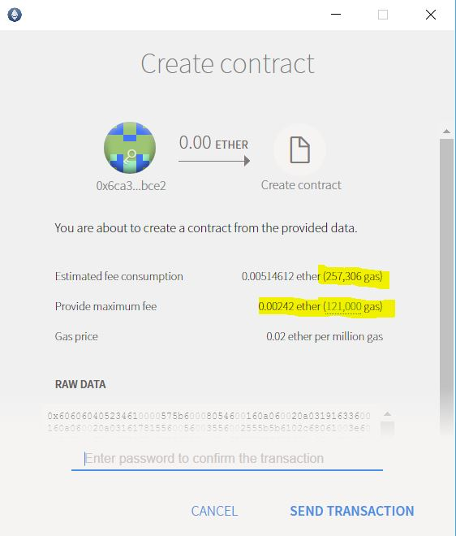
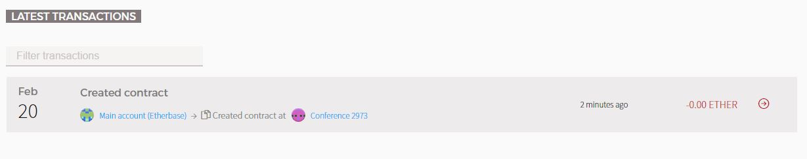

# Connect to a network using the Ethereum Wallet #

The Ethereum Wallet is a useful application that can be used to inspect contracts, accounts, transactions 
and events on the chain. This walk through will step you through using the wallet to deploy and interact with 
a contract.

1. **Install and launch the Ethereum Wallet**

    * Install and launch using PowerShell

            ./00.Setup/windows/LaunchEthereumWallet.ps1
    
    * Manually Download the [Ethereum Wallet]
    * Extract the files
    * Launch "Ethereum Wallet.exe"

    Note: that by default if there is no local geth instance running the Ethereum Wallet will launch it's own local
    copy of geth that will by default attempt to connect to the active public network. The wallet may also be switched
    to connect to the test network and enable mining.

    Note: this sample assumes that the steps in the [Local Blockchain](../01.LocalBlockchain) were followed.

2. **Confirm available account exists**

    If the wallet launches correctly and connects to the local instance of the Blockchain running the 
    UI should display a list of 3 accounts. Two accounts will have 0 ether and one account will have 1,000,000 ether that continues to go up due to mining rewards being issued.

    

3. **Deploy the Conference contract**
    * Click contracts

        

    * Click Deploy New Contract

        
    
    * Copy the contents of the [Conference Contract](../Contracts/Conference.sol)
    * Paste the contents of the Conference contract into the Solidity Contract source code windows

        
    * The contract should compile and then display a drop down on the right hand side that says
    pick a contract.
    * Select Conference from the drop down list
    * Click Deploy at the bottom of the page
    * A new window should pop up that look like this

        
    
        *NOTE: The highlighted sections. Sometimes the estimation math fails and the provided value defaults
        to 121,000. If the value of the contract you wish to deploy costs more than this you must click on 
        the value and change it. I would suggest the estimated value +100,000.*
    * Click Send transaction
    
        At this point the transaction will be signed and sent to the miner. It should only take a few seconds
        for the transaction to be mined. If you click Wallets at the top of the UI this will take you back to the main page where you will find a list of transactions that have be submitted and their current state. 

        A transaction that has less then 12 blocks after it is considered to be an unconfirmed transacation,
        in this case the transaction will show up as a gray transaction with a moving bar until confirmed.

4. **Reserve a conference ticket**
    * Once deployment has completed on the main page you should find a Created contract transaction

    

    * Click the second link in the image it's *Conference 2973*, but in your local deployment the value may differ
    
        You should now be at the Conference contract viewer that will allow you to interact with the contract.
    * Click Pick A Function
    * Click Buy Ticket, from the drop down
    * Click Execute

        At this point a new transaction will be created and ticket will be purchased. If you come back to the Conference viewer you will eventually see the Registrants increase to 1 from 0.

        Feel free to explore other functions of the contract.

## Enjoy !

[Ethereum Wallet]:https://github.com/ethereum/mist/releases